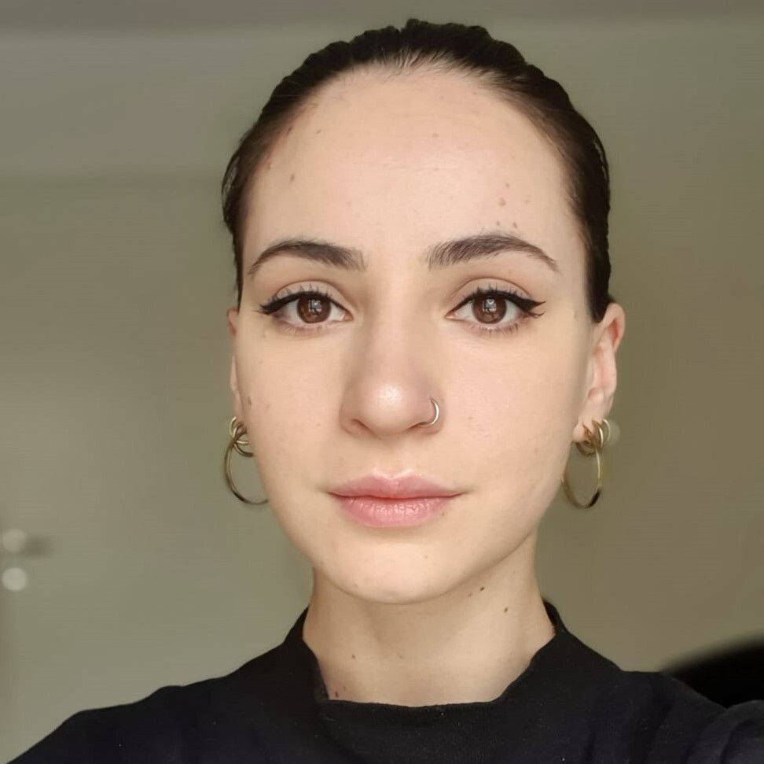

# Swedish e-Science Academy Satellite on Social Cybersecurity (Oct 13, 2026)

We are happy to announce our workshop on Social Cybersecurity, taking place on the **October 13th** in **Uppsala**. 

The goal of the workshop is to have expert discussions about the systematic identification, prevention, and mitigation of harmful online phenomena. Topics of interest are, for example, the theoretical advancements and development of interdisciplinary approaches in the study of social cyberharms and the current limitations within the field. 

The workshop is hosted as a satellite to the [Swedish e-Science Academy](https://www.essenceofescience.se/w/es/en/about-essence/swedish-e-science-academy): participants associated with any of the three eSSENCE partner universities (Umeå, Lund, and Uppsala) will get their accommodation covered through eSSENCE. 

## Invited speakers

- Henna Paakki (University of Helsinki)
- Gianmarco De Francisci Morales (Intesa Sanpaolo Innovation Center, Turin)
- Third invited speaker TBC

## Registration

The workshop is free of charge and includes lunch and fika on October 13th. Please note that the number of participants for lunch is limited, so early registration is recommended. 

You can sign up to attend our workshop by registering through the official conference form (below) and specifying the events you wish to attend.
If you are not affiliated with any of the eSSENCE nodes you may still request a hotel night in the registration form. Please note, however, that availability cannot be guaranteed.

Note that signing up for posters through the official registration form is for presentations at the main conference.
**If you are interested in presenting something at the workshop** (format to be decided), feel free to contact [us](#organizing-committee) **no later than end of September**.

[**Direct link to register**](https://registration.invajo.com/c2313c25-aff9-4efc-bd74-a2b0641e374e).

## Program

**October 13th, 2026** 
**Location TBD**

Full day schedule

09.00 - 09.30 Welcome to the Social Cybersecurity workshop  
09.30 - 10.00 Invited speaker 1  
10.00 - 10.30 Invited speaker 2  
10.30 - 11.00 Coffee break  
11.00 - 11.30 Invited speaker 3  
11.30 - 12.00 Short presentations  
12.00 - 13.00 Lunch (venue TBD)  

13.00 - 13.15 Intro to afternoon activities  
13.15 - 13.45 Short presentations  
13.45 - 14.30 Panel discussion  
14.30 - 15.00 Coffee break  
15.00 - 15.45 Group activity: mind map discussion  
15.45 - 16.00 Closing remarks  

## Organizing committee

Contacts

<table>
  <tr>
    <td align="center" style="padding-right:30px;">
       
      <strong>Diletta Goglia</strong>
       
      <a href="https://dilettagoglia.github.io/main/">Webpage</a>
       
      <a href="mailto:diletta.goglia@it.uu.se">diletta.goglia@it.uu.se</a>
    </td>
    <td align="center" style="padding-left:30px;">
       
      <strong>Inga K. Wohlert</strong>
       
      <a href="https://www.uu.se/en/contact-and-organisation/staff?query=N23-1365">Webpage</a>
       
      <a href="mailto:inga.wohlert@it.uu.se">inga.wohlert@it.uu.se</a>
    </td>
  </tr>
</table>

 

[UU-InfoLab](https://uuinfolab.github.io/), Department of Information Technology, Uppsala University.

## Acknowledgments
We gratefully acknowledge support from [eSSENCE](https://www.essenceofescience.se/w/es/en).
